laura eda
================
Laura Cosgrove
3/26/2019

``` r
library(tidyverse)
library(ggjoy)
```

Organizing factors
------------------

``` r
heart <- read_csv("./data/train.csv")
```

    ## Parsed with column specification:
    ## cols(
    ##   .default = col_double(),
    ##   row_id = col_integer(),
    ##   heart_disease_mortality_per_100k = col_integer(),
    ##   metro = col_character(),
    ##   population = col_character(),
    ##   area__urban_influence = col_character(),
    ##   econ__economic_typology = col_character(),
    ##   demo__birth_rate_per_1k = col_integer(),
    ##   demo__death_rate_per_1k = col_integer(),
    ##   health__air_pollution_particulate_matter = col_integer(),
    ##   health__pop_per_dentist = col_integer(),
    ##   health__pop_per_primary_care_physician = col_integer(),
    ##   yr = col_character()
    ## )

    ## See spec(...) for full column specifications.

``` r
heart %>% 
  ggplot(aes(x = heart_disease_mortality_per_100k, y = metro, height=..density..)) +
  geom_joy(scale = 0.85)
```

    ## Picking joint bandwidth of 12.6

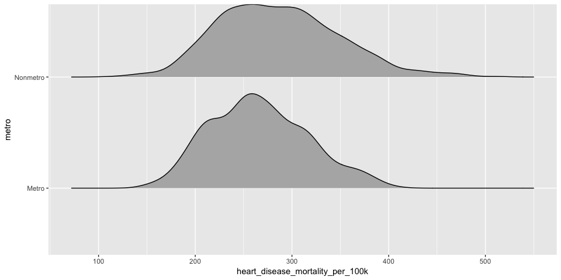

``` r
heart %>% 
  ggplot(aes(x = heart_disease_mortality_per_100k, y = population, fill = metro, height=..density..)) +
  geom_joy(scale = 0.85)
```

    ## Picking joint bandwidth of 17.7

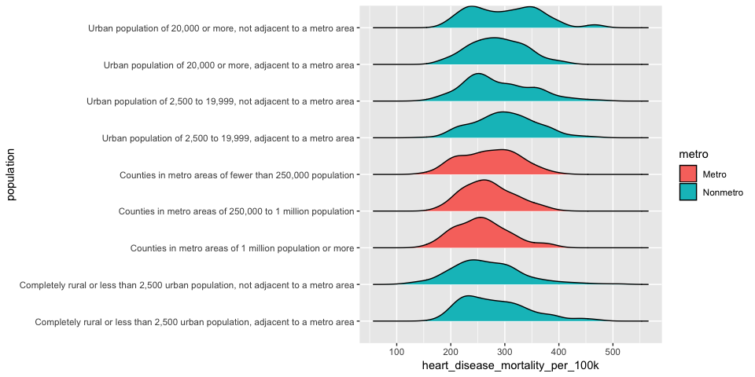

Bimodal distribution for "urban population of 20,000 or more"

``` r
heart <- heart %>% 
  mutate(population = factor(population, levels = c(
    "Counties in metro areas of 1 million population or more", 
    "Counties in metro areas of 250,000 to 1 million population", 
    "Counties in metro areas of fewer than 250,000 population", 
    "Urban population of 20,000 or more, adjacent to a metro area", 
    "Urban population of 20,000 or more, not adjacent to a metro area", 
    "Urban population of 2,500 to 19,999, adjacent to a metro area", 
    "Urban population of 2,500 to 19,999, not adjacent to a metro area", 
    "Completely rural or less than 2,500 urban population, adjacent to a metro area", 
    "Completely rural or less than 2,500 urban population, not adjacent to a metro area"),
    labels = c("Metro > 1 million", "Metro 250k - 1 million", "Metro <250k", "Urban >20,000 metro-adjacent", "Urban >20,000 metro non-adjacent","Urban 2,500-19,999 metro-adjacent", "Urban 2,500-19,999 metro non-adjacent", "Rural metro-adjacent", "Rural metro non-adjacent")),
    metro = factor(metro, levels = c("Metro", "Nonmetro")),
    area__urban_influence = factor(area__urban_influence, levels = c(
      "Large-in a metro area with at least 1 million residents or more", 
      "Small-in a metro area with fewer than 1 million residents",
      "Micropolitan adjacent to a large metro area",
      "Noncore adjacent to a large metro area",
      "Micropolitan adjacent to a small metro area",
      "Noncore adjacent to a small metro with town of at least 2,500 residents",
      "Noncore adjacent to a small metro and does not contain a town of at least 2,500 residents",
      "Micropolitan not adjacent to a metro area",
      "Noncore adjacent to micro area and contains a town of 2,500-19,999 residents",
      "Noncore adjacent to micro area and does not contain a town of at least 2,500 residents",
      "Noncore not adjacent to a metro/micro area and contains a town of 2,500  or more residents",
      "Noncore not adjacent to a metro/micro area and does not contain a town of at least 2,500 residents"),
      labels = 1:12)) %>% 
  mutate(area__urban_influence = fct_rev(area__urban_influence)) %>% 
  rename(metro_ruccs = metro, 
         population_ruccs = population,
         urban_influence = area__urban_influence)

heart %>% 
  ggplot(aes(y = heart_disease_mortality_per_100k, x = population_ruccs, fill = metro_ruccs)) +
  geom_boxplot() +
  coord_flip()
```

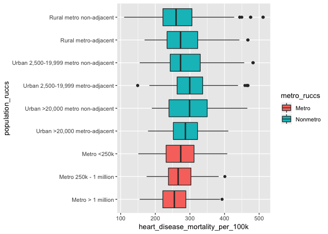

``` r
heart %>% 
  ggplot(aes(y = heart_disease_mortality_per_100k, x = urban_influence, fill = metro_ruccs)) +
  geom_boxplot() +
  coord_flip()
```

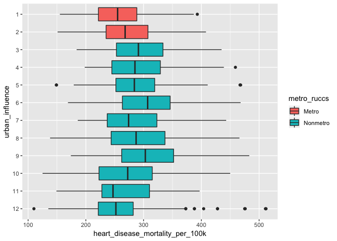

``` r
heart <- heart %>% 
  rename(economic_typology = econ__economic_typology) %>% 
  mutate(economic_typology = factor(economic_typology),
         economic_typology = fct_inorder(economic_typology)) 

heart %>% 
  ggplot(aes(y = heart_disease_mortality_per_100k, x = economic_typology, fill = metro_ruccs)) +
  geom_boxplot() +
  coord_flip()
```

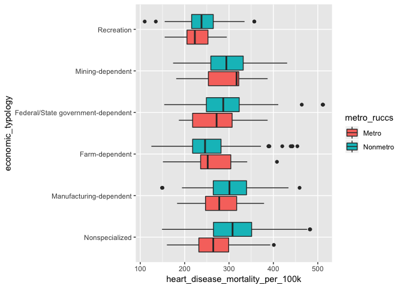

Not a huge consistent effect for these area and economic typologies.

``` r
heart <- heart %>% 
  mutate(pure_population = fct_collapse(population_ruccs, "> 1,000,000" = "Metro > 1 million",
                                        "250,000 - 1,000,000" = "Metro 250k - 1 million",
                                        "< 250,000" = "Metro <250k",
                                        ">20,000" = c("Urban >20,000 metro-adjacent", "Urban >20,000 metro non-adjacent"),
                                        "2,500 - <20,000" = c("Urban 2,500-19,999 metro-adjacent", "Urban 2,500-19,999 metro non-adjacent"),
                                        "< 2,500" = c("Rural metro-adjacent", "Rural metro non-adjacent")),
         metro_adjacency = fct_collapse(population_ruccs, metro = c("Metro > 1 million", "Metro 250k - 1 million", "Metro <250k"),
                                        adjacent = c("Urban >20,000 metro-adjacent", "Urban 2,500-19,999 metro-adjacent", "Rural metro-adjacent"),
                                        nonadjacent = c("Urban >20,000 metro non-adjacent", "Urban 2,500-19,999 metro non-adjacent", "Rural metro non-adjacent")))

heart %>% 
  select(pure_population, metro_adjacency)
```

    ## # A tibble: 2,132 x 2
    ##    pure_population metro_adjacency
    ##    <fct>           <fct>          
    ##  1 > 1,000,000     metro          
    ##  2 2,500 - <20,000 adjacent       
    ##  3 < 2,500         nonadjacent    
    ##  4 >20,000         adjacent       
    ##  5 < 2,500         nonadjacent    
    ##  6 2,500 - <20,000 adjacent       
    ##  7 > 1,000,000     metro          
    ##  8 >20,000         adjacent       
    ##  9 > 1,000,000     metro          
    ## 10 < 250,000       metro          
    ## # ... with 2,122 more rows

``` r
heart %>% 
  ggplot(aes(x = heart_disease_mortality_per_100k, y = pure_population, fill = metro_ruccs, height=..density..)) +
  geom_joy(scale = 0.85)
```

    ## Picking joint bandwidth of 15.4

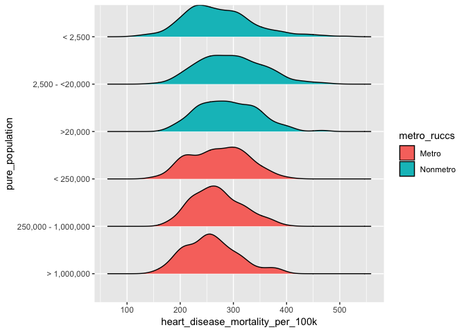

``` r
heart %>% 
  ggplot(aes(x = heart_disease_mortality_per_100k, y = pure_population, fill = urban_influence, height=..density..)) +
  geom_joy(scale = 0.85, alpha = 0.3)
```

    ## Picking joint bandwidth of 21.5

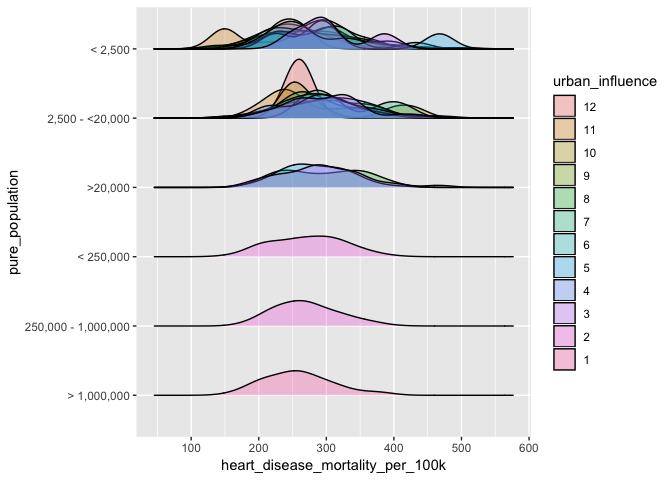

``` r
##sample size of what's shown above?
heart %>% group_by(urban_influence, pure_population) %>% 
  summarize(count = n()) %>% 
  arrange(count) %>% 
  knitr::kable()
```

| urban\_influence | pure\_population    |  count|
|:-----------------|:--------------------|------:|
| 4                | &gt;20,000          |      1|
| 6                | &gt;20,000          |      2|
| 12               | 2,500 - &lt;20,000  |      3|
| 11               | &lt; 2,500          |      6|
| 10               | 2,500 - &lt;20,000  |      7|
| 5                | &lt; 2,500          |      8|
| 3                | &lt; 2,500          |      8|
| 7                | 2,500 - &lt;20,000  |     14|
| 9                | &lt; 2,500          |     19|
| 6                | &lt; 2,500          |     19|
| 4                | &lt; 2,500          |     23|
| 3                | 2,500 - &lt;20,000  |     24|
| 8                | &lt; 2,500          |     37|
| 8                | &gt;20,000          |     59|
| 3                | &gt;20,000          |     59|
| 8                | 2,500 - &lt;20,000  |     68|
| 5                | 2,500 - &lt;20,000  |     74|
| 4                | 2,500 - &lt;20,000  |     77|
| 11               | 2,500 - &lt;20,000  |     82|
| 7                | &lt; 2,500          |     89|
| 5                | &gt;20,000          |    110|
| 9                | 2,500 - &lt;20,000  |    118|
| 10               | &lt; 2,500          |    129|
| 12               | &lt; 2,500          |    144|
| 6                | 2,500 - &lt;20,000  |    209|
| 2                | &lt; 250,000        |    210|
| 2                | 250,000 - 1,000,000 |    245|
| 1                | &gt; 1,000,000      |    288|

``` r
##yup outliers


heart %>% 
  ggplot(aes(x = heart_disease_mortality_per_100k, y = metro_adjacency, fill = urban_influence, height=..density..)) +
  geom_joy(scale = 0.85, alpha = 0.3) 
```

    ## Picking joint bandwidth of 18.8

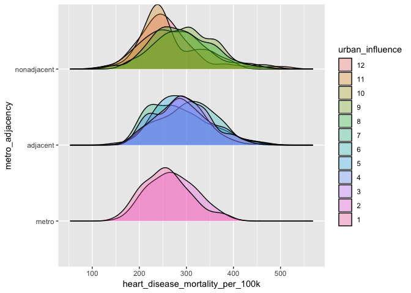

would it be worth it to test with these collapsed factors? metro\_adjacency simply functions as a collapsing of the urban\_influence variable.

there's some possible interaction on pure\_population with urban influence at the small population levels but it's probably a result of small sample size

Done with Factors! onto continuous predictors
---------------------------------------------

``` r
str_remove_hlth <- function(x) {
  str_remove(x, pattern = "health__")
}

substring = function (x) {str_sub(x, start = -20)}

#Within category correlation
heart %>% 
  select_if(is.numeric) %>% 
  select(starts_with("econ")) %>% 
  rename_all(substring) %>% 
  drop_na() %>% 
  cor() %>% 
  corrplot::corrplot(method = "ellipse")
```

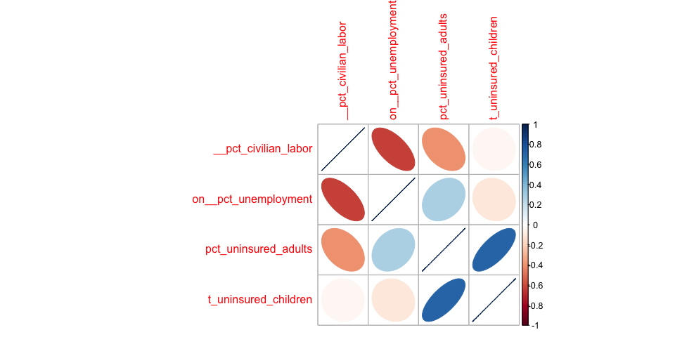

``` r
heart %>% 
  select_if(is.numeric) %>% 
  select(starts_with("demo")) %>% 
  rename_all(substring) %>% 
  drop_na() %>% 
  cor() %>% 
  corrplot::corrplot(method = "ellipse")
```

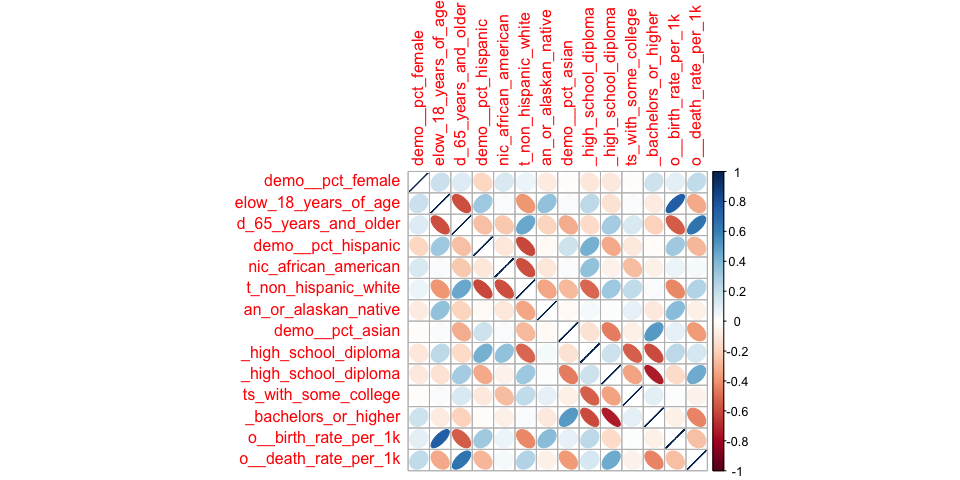

``` r
heart %>% 
  select_if(is.numeric) %>% 
  select(starts_with("health")) %>% 
  rename_all(substring) %>% 
  drop_na() %>% 
  cor() %>% 
  corrplot::corrplot(method = "ellipse")
```

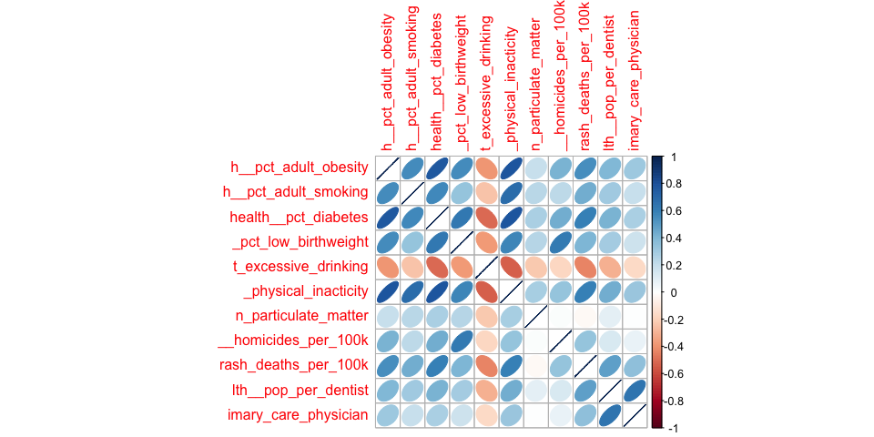

``` r
heart$eco
```

    ## Warning: Unknown or uninitialised column: 'eco'.

    ## NULL

Health statistics related to healthy behaviors are highly intercorrelated: obesity, smoking, diabetes, low birthweight babies, excessive drinking, and physical inactivity. Less so are more environment- or "acts of God"-related health behaviors: particulate matter, homocides, motor vehicle crashes, and rates of dentists and doctors (though the last two are highly correlated).

For demography, there's some categorical variables masquerading as separate predictors, leading to high intercorrelation within those categories: percentages of residents who are a given race accounts for 5 variables; age-related bins (less than 18, greater than 65) account for 2 variables; birth and death rate; and percentages of residents who complete a given level of education account for 4 variables.

For economics, unsurprisingly, the percent of adults and the percent of children without health insurance are highly correlated, as well as percent civilian labor and unemployment rate.

*Overall*: we have a large amount of multicollinearity, and ideally lasso and ridge will allow us to reduce the number of variables who are poorer predictors. I would predict ridge to do well here.

Correlation with predictor
--------------------------

``` r
cor_matrix <- heart %>% 
  select_if(is.numeric) %>% 
  select(-row_id) %>% 
  drop_na() %>% 
  cor()

cor_tibble = as_tibble(cor_matrix)

heart_attacks_cor = tibble(variable = names(cor_tibble),
                     correlation = cor_tibble$heart_disease_mortality_per_100k)

heart_attacks_cor %>% 
  arrange(desc(abs(correlation)))
```

    ## # A tibble: 30 x 2
    ##    variable                                  correlation
    ##    <chr>                                           <dbl>
    ##  1 heart_disease_mortality_per_100k                1    
    ##  2 health__pct_physical_inacticity                 0.811
    ##  3 health__pct_adult_obesity                       0.723
    ##  4 health__pct_diabetes                            0.691
    ##  5 demo__pct_adults_bachelors_or_higher           -0.649
    ##  6 health__pct_adult_smoking                       0.602
    ##  7 demo__death_rate_per_1k                         0.596
    ##  8 demo__pct_adults_with_high_school_diploma       0.579
    ##  9 health__pct_low_birthweight                     0.569
    ## 10 econ__pct_civilian_labor                       -0.568
    ## # ... with 20 more rows

``` r
heart_attacks_cor %>% 
  arrange(abs(correlation))
```

    ## # A tibble: 30 x 2
    ##    variable                                    correlation
    ##    <chr>                                             <dbl>
    ##  1 econ__pct_uninsured_children                     0.0186
    ##  2 demo__pct_female                                 0.0394
    ##  3 demo__pct_american_indian_or_alaskan_native      0.0521
    ##  4 demo__pct_non_hispanic_white                    -0.0742
    ##  5 demo__pct_aged_65_years_and_older                0.0922
    ##  6 demo__pct_below_18_years_of_age                  0.0944
    ##  7 demo__pct_adults_with_some_college              -0.130 
    ##  8 demo__birth_rate_per_1k                          0.157 
    ##  9 health__air_pollution_particulate_matter         0.172 
    ## 10 health__pop_per_primary_care_physician           0.242 
    ## # ... with 20 more rows

Above are the most highly-correlated variables with our outcome, and the least-correlated.
