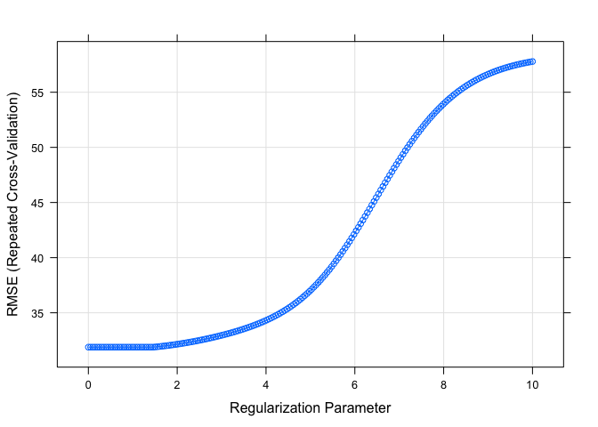
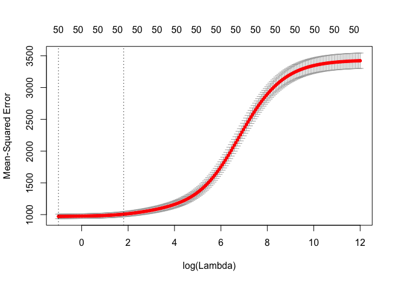
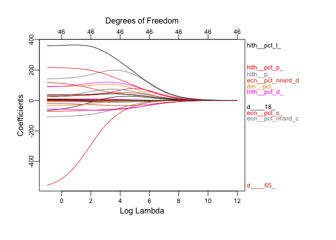
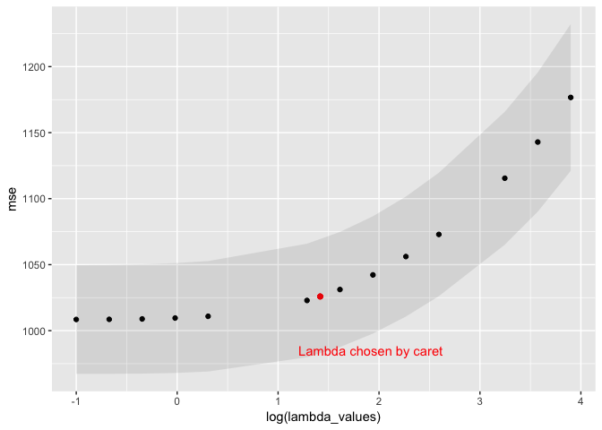

Laura\_modeling
================
Laura Cosgrove
3/28/2019

``` r
library(tidyverse)
library(caret)
library(modelr)
library(glmnet)
library(pls)
```

``` r
heart <- read_csv("./data/laura_test_version.csv") %>% 
  select(-row_id)
```

    ## Parsed with column specification:
    ## cols(
    ##   .default = col_double(),
    ##   row_id = col_integer(),
    ##   heart_disease_mortality_per_100k = col_integer(),
    ##   metro_ruccs = col_character(),
    ##   population_ruccs = col_character(),
    ##   urban_influence = col_integer(),
    ##   economic_typology = col_character(),
    ##   demo__birth_rate_per_1k = col_integer(),
    ##   demo__death_rate_per_1k = col_integer(),
    ##   health__air_pollution_particulate_matter = col_integer(),
    ##   health__pop_per_dentist = col_integer(),
    ##   health__pop_per_primary_care_physician = col_integer(),
    ##   yr = col_character(),
    ##   pure_population = col_character(),
    ##   metro_adjacency = col_character()
    ## )

    ## See spec(...) for full column specifications.

``` r
skimr::skim(heart)
```

    ## Skim summary statistics
    ##  n obs: 2132 
    ##  n variables: 37 
    ## 
    ## ── Variable type:character ───────────────────────────────────────────────────────────────────────────────────────────────────
    ##           variable missing complete    n min max empty n_unique
    ##  economic_typology       0     2132 2132  10  34     0        6
    ##    metro_adjacency       0     2132 2132   5  11     0        3
    ##        metro_ruccs       0     2132 2132   5   8     0        2
    ##   population_ruccs       0     2132 2132  11  37     0        9
    ##    pure_population       0     2132 2132   7  19     0        6
    ##                 yr       0     2132 2132   1   1     0        2
    ## 
    ## ── Variable type:integer ─────────────────────────────────────────────────────────────────────────────────────────────────────
    ##                                  variable missing complete    n    mean
    ##                   demo__birth_rate_per_1k       0     2132 2132   11.74
    ##                   demo__death_rate_per_1k       0     2132 2132   10.29
    ##  health__air_pollution_particulate_matter      25     2107 2132   11.61
    ##                   health__pop_per_dentist     161     1971 2132 3368.7 
    ##    health__pop_per_primary_care_physician     142     1990 2132 2498.79
    ##          heart_disease_mortality_per_100k       0     2132 2132  279.55
    ##                           urban_influence       0     2132 2132    5.43
    ##       sd  p0     p25    p50  p75  p100     hist
    ##     2.78   4   10      11     13    29 ▁▅▇▃▁▁▁▁
    ##     2.75   1    8      10     12    22 ▁▂▃▇▆▁▁▁
    ##     1.55   7   10      12     13    15 ▁▂▅▅▆▇▂▁
    ##  2392.15 350 1814.5  2690   4044 25310 ▇▃▁▁▁▁▁▁
    ##  1929.37 189 1422.25 2009.5 2870 20910 ▇▂▁▁▁▁▁▁
    ##    59.26 110  237     275    317   512 ▁▃▇▇▅▂▁▁
    ##     3.55   1    2       5      8    12 ▇▁▃▂▁▃▂▂
    ## 
    ## ── Variable type:numeric ─────────────────────────────────────────────────────────────────────────────────────────────────────
    ##                                          variable missing complete    n
    ##              demo__pct_adults_bachelors_or_higher       0     2132 2132
    ##  demo__pct_adults_less_than_a_high_school_diploma       0     2132 2132
    ##         demo__pct_adults_with_high_school_diploma       0     2132 2132
    ##                demo__pct_adults_with_some_college       0     2132 2132
    ##                 demo__pct_aged_65_years_and_older       1     2131 2132
    ##       demo__pct_american_indian_or_alaskan_native       1     2131 2132
    ##                                   demo__pct_asian       1     2131 2132
    ##                   demo__pct_below_18_years_of_age       1     2131 2132
    ##                                  demo__pct_female       1     2131 2132
    ##                                demo__pct_hispanic       1     2131 2132
    ##           demo__pct_non_hispanic_african_american       1     2131 2132
    ##                      demo__pct_non_hispanic_white       1     2131 2132
    ##                          econ__pct_civilian_labor       0     2132 2132
    ##                            econ__pct_unemployment       0     2132 2132
    ##                        econ__pct_uninsured_adults       1     2131 2132
    ##                      econ__pct_uninsured_children       1     2131 2132
    ##                        health__homicides_per_100k    1299      833 2132
    ##       health__motor_vehicle_crash_deaths_per_100k     283     1849 2132
    ##                         health__pct_adult_obesity       1     2131 2132
    ##                         health__pct_adult_smoking     290     1842 2132
    ##                              health__pct_diabetes       1     2131 2132
    ##                    health__pct_excessive_drinking     634     1498 2132
    ##                       health__pct_low_birthweight     125     2007 2132
    ##                   health__pct_physical_inacticity       1     2131 2132
    ##    mean     sd     p0    p25    p50    p75  p100     hist
    ##   0.2    0.087  0.025  0.14   0.18   0.23   0.79 ▂▇▃▁▁▁▁▁
    ##   0.15   0.068  0.015  0.097  0.13   0.19   0.41 ▂▇▇▆▃▁▁▁
    ##   0.35   0.07   0.075  0.31   0.35   0.4    0.56 ▁▁▂▅▇▆▂▁
    ##   0.3    0.053  0.11   0.27   0.3    0.34   0.47 ▁▁▃▇▇▅▂▁
    ##   0.17   0.044  0.045  0.14   0.17   0.2    0.35 ▁▂▆▇▃▁▁▁
    ##   0.026  0.087  0      0.002  0.007  0.015  0.85 ▇▁▁▁▁▁▁▁
    ##   0.013  0.027  0      0.003  0.007  0.013  0.34 ▇▁▁▁▁▁▁▁
    ##   0.23   0.034  0.092  0.21   0.23   0.25   0.42 ▁▁▅▇▂▁▁▁
    ##   0.5    0.024  0.28   0.49   0.5    0.51   0.57 ▁▁▁▁▁▃▇▁
    ##   0.091  0.14   0      0.019  0.035  0.09   0.93 ▇▁▁▁▁▁▁▁
    ##   0.091  0.15   0      0.006  0.023  0.097  0.86 ▇▁▁▁▁▁▁▁
    ##   0.77   0.21   0.061  0.64   0.85   0.94   0.99 ▁▁▁▁▂▂▃▇
    ##   0.47   0.073  0.21   0.42   0.47   0.51   0.94 ▁▂▇▇▁▁▁▁
    ##   0.06   0.024  0.01   0.044  0.057  0.072  0.25 ▂▇▃▁▁▁▁▁
    ##   0.22   0.067  0.046  0.17   0.22   0.26   0.47 ▁▅▇▇▅▂▁▁
    ##   0.086  0.039  0.015  0.058  0.078  0.11   0.28 ▃▇▅▂▁▁▁▁
    ##   6.08   5.2   -0.4    2.7    4.8    8     50.49 ▇▅▁▁▁▁▁▁
    ##  21.2   10.29   3.3   13.74  19.73  26.49  84.51 ▅▇▅▂▁▁▁▁
    ##   0.31   0.043  0.13   0.28   0.31   0.34   0.46 ▁▁▂▅▇▃▁▁
    ##   0.21   0.063  0.046  0.17   0.21   0.25   0.51 ▁▃▇▆▂▁▁▁
    ##   0.11   0.023  0.032  0.094  0.11   0.12   0.2  ▁▁▆▇▅▂▁▁
    ##   0.17   0.05   0.038  0.13   0.17   0.2    0.37 ▁▅▇▇▅▂▁▁
    ##   0.084  0.022  0.033  0.069  0.081  0.095  0.24 ▂▇▅▂▁▁▁▁
    ##   0.28   0.052  0.1    0.24   0.28   0.31   0.42 ▁▁▂▆▇▆▃▁

``` r
#removing var with over 10% missing health__homicides_per_100k, health__pct_excessive_drinking

heart <- heart %>% 
  select(-health__homicides_per_100k, 
    -health__pct_excessive_drinking)
#two missingest variables

heart_nona <- heart %>% 
  drop_na()

x <- model.matrix(heart_disease_mortality_per_100k ~ ., data = heart_nona)[,-1]
y <- heart_nona$heart_disease_mortality_per_100k
```

Set up `caret` training control. We will use this for all models.

``` r
set.seed(100)
ctrl1 <- trainControl(method = "repeatedcv", number = 10, repeats = 5)
```

### Ridge

Cross validate to find the optimal lambda value.

``` r
set.seed(100)

ridge_fit <- train(x, y,
                     method = "glmnet",
                     tuneGrid = expand.grid(alpha = 0, 
                                            lambda = exp(seq(-1, 12, length = 200))),
                    #preProc = c("center", "scale"),
                     trControl = ctrl1)
```

    ## Warning in nominalTrainWorkflow(x = x, y = y, wts = weights, info =
    ## trainInfo, : There were missing values in resampled performance measures.

``` r
plot(ridge_fit, xTrans = function(x) log(x)) #in correct range
```



``` r
best_lambda_ridge = ridge_fit$bestTune$lambda # lower lambda bc adjusted bounds


#ridge_pred <- predict(ridge_fit$finalModel, s = best_lambda_ridge, newx = x_test)

#ridge_MSE = mean((ridge_pred - y_test)^2) #slightly lower mse

#Glmnet for vizualization #i think this is bad
ridge_cv_glmnet <- cv.glmnet(x, y, 
                      alpha = 0, 
                      lambda = exp(seq(-1, 12, length = 200)), 
                      type.measure = "mse")

plot(ridge_cv_glmnet, xvar = "lambda", label = TRUE)
```

    ## Warning in plot.window(...): "xvar" is not a graphical parameter

    ## Warning in plot.window(...): "label" is not a graphical parameter

    ## Warning in plot.xy(xy, type, ...): "xvar" is not a graphical parameter

    ## Warning in plot.xy(xy, type, ...): "label" is not a graphical parameter

    ## Warning in axis(side = side, at = at, labels = labels, ...): "xvar" is not
    ## a graphical parameter

    ## Warning in axis(side = side, at = at, labels = labels, ...): "label" is not
    ## a graphical parameter

    ## Warning in axis(side = side, at = at, labels = labels, ...): "xvar" is not
    ## a graphical parameter

    ## Warning in axis(side = side, at = at, labels = labels, ...): "label" is not
    ## a graphical parameter

    ## Warning in box(...): "xvar" is not a graphical parameter

    ## Warning in box(...): "label" is not a graphical parameter

    ## Warning in title(...): "xvar" is not a graphical parameter

    ## Warning in title(...): "label" is not a graphical parameter



``` r
plotmo::plot_glmnet(ridge_cv_glmnet$glmnet.fit, xvar = "lambda")
```



``` r
ridge_cv_table <- tibble(lambda_values = ridge_cv_glmnet$lambda, mse = ridge_cv_glmnet$cvm, mse_upper = ridge_cv_glmnet$cvup, mse_lower = ridge_cv_glmnet$cvlo)

##MSE
ridge_cv_table %>% 
  arrange(mse) %>% 
  filter(lambda_values == best_lambda_ridge)
```

    ## # A tibble: 1 x 4
    ##   lambda_values   mse mse_upper mse_lower
    ##           <dbl> <dbl>     <dbl>     <dbl>
    ## 1          4.13  995.     1034.      955.

``` r
ridge_mse_plot <- ridge_cv_table %>% 
  filter(lambda_values %in% exp(seq(-1, 4, length = 200))) %>% 
  ggplot(aes(x = log(lambda_values), y = mse)) +
  geom_point() +
  geom_point(aes(x = log(best_lambda_ridge), y = 995), color = "red") +
  geom_ribbon(aes(ymin = mse_lower, ymax = mse_upper), alpha = 0.1)
  
ridge_mse_plot + annotate("text", x = 0.5 + log(best_lambda_ridge), y = 985, label = "Lambda chosen by caret", color = "red")
```



``` r
#for fun


## Fit a glmnet with besttune from caret

ridge_glmnet <- glmnet(x, y, alpha = 0, lambda = best_lambda_ridge)

broom::tidy(ridge_glmnet) %>% 
  arrange(abs(estimate)) #see shrunk coefficients with lambda chosen by caret
```

    ## # A tibble: 51 x 5
    ##    term                                     step estimate lambda dev.ratio
    ##    <chr>                                   <dbl>    <dbl>  <dbl>     <dbl>
    ##  1 health__pop_per_dentist                     1  6.97e-4   4.13     0.724
    ##  2 health__pop_per_primary_care_physician      1 -9.43e-4   4.13     0.724
    ##  3 health__motor_vehicle_crash_deaths_per…     1  5.00e-1   4.13     0.724
    ##  4 population_ruccsUrban 2,500-19,999 met…     1 -6.63e-1   4.13     0.724
    ##  5 economic_typologyManufacturing-depende…     1  8.81e-1   4.13     0.724
    ##  6 pure_population>20,000                      1  1.17e+0   4.13     0.724
    ##  7 pure_population2,500 - <20,000              1  1.25e+0   4.13     0.724
    ##  8 pure_population> 1,000,000                  1  1.42e+0   4.13     0.724
    ##  9 demo__birth_rate_per_1k                     1  1.46e+0   4.13     0.724
    ## 10 urban_influence                             1 -1.60e+0   4.13     0.724
    ## # ... with 41 more rows

``` r
predict(ridge_glmnet, s = best_lambda_ridge, type="coefficients") 
```

    ## 51 x 1 sparse Matrix of class "dgCMatrix"
    ##                                                                   1
    ## (Intercept)                                            1.170370e+02
    ## metro_ruccsNonmetro                                    1.758975e+00
    ## population_ruccsMetro > 1 million                      1.683219e+00
    ## population_ruccsMetro 250k - 1 million                -2.390555e+00
    ## population_ruccsRural metro non-adjacent               1.788495e+00
    ## population_ruccsRural metro-adjacent                  -2.920196e+00
    ## population_ruccsUrban >20,000 metro non-adjacent       9.242630e+00
    ## population_ruccsUrban >20,000 metro-adjacent          -2.435937e+00
    ## population_ruccsUrban 2,500-19,999 metro non-adjacent  2.713711e+00
    ## population_ruccsUrban 2,500-19,999 metro-adjacent     -6.628882e-01
    ## urban_influence                                       -1.600263e+00
    ## economic_typologyFederal/State government-dependent    4.656914e+00
    ## economic_typologyManufacturing-dependent               8.806091e-01
    ## economic_typologyMining-dependent                      7.153622e+00
    ## economic_typologyNonspecialized                        1.775345e+00
    ## economic_typologyRecreation                           -6.475776e+00
    ## econ__pct_civilian_labor                              -6.255932e+01
    ## econ__pct_unemployment                                 5.507548e+01
    ## econ__pct_uninsured_adults                             1.048505e+02
    ## econ__pct_uninsured_children                          -7.006002e+01
    ## demo__pct_female                                       7.524871e+01
    ## demo__pct_below_18_years_of_age                        2.712488e+01
    ## demo__pct_aged_65_years_and_older                     -3.656328e+02
    ## demo__pct_hispanic                                    -4.977032e+01
    ## demo__pct_non_hispanic_african_american                7.501424e+00
    ## demo__pct_non_hispanic_white                           2.410228e+00
    ## demo__pct_american_indian_or_alaskan_native           -8.237652e+01
    ## demo__pct_asian                                        8.531104e+00
    ## demo__pct_adults_less_than_a_high_school_diploma       3.951695e+01
    ## demo__pct_adults_with_high_school_diploma              4.311498e+01
    ## demo__pct_adults_with_some_college                    -5.574889e+01
    ## demo__pct_adults_bachelors_or_higher                  -2.972377e+01
    ## demo__birth_rate_per_1k                                1.461743e+00
    ## demo__death_rate_per_1k                                7.348661e+00
    ## health__pct_adult_obesity                              7.245974e+01
    ## health__pct_adult_smoking                              7.311802e+01
    ## health__pct_diabetes                                   1.128643e+02
    ## health__pct_low_birthweight                            2.259042e+02
    ## health__pct_physical_inacticity                        2.031697e+02
    ## health__air_pollution_particulate_matter              -2.087671e+00
    ## health__motor_vehicle_crash_deaths_per_100k            4.996311e-01
    ## health__pop_per_dentist                                6.969031e-04
    ## health__pop_per_primary_care_physician                -9.433868e-04
    ## yrb                                                   -4.930563e+00
    ## pure_population< 250,000                              -2.786769e+00
    ## pure_population> 1,000,000                             1.416386e+00
    ## pure_population>20,000                                 1.166780e+00
    ## pure_population2,500 - <20,000                         1.247457e+00
    ## pure_population250,000 - 1,000,000                    -2.693176e+00
    ## metro_adjacencymetro                                  -2.174717e+00
    ## metro_adjacencynonadjacent                             4.788807e+00

Our best lambda is 4.1250801, but it's not an entirely stable value because RMSE does not differ substantially in the range; that is, glm chooses a different value. I think we should proceed with the lambda chosen by caret because of its more stringent shrinking power. With that, our MSE is:

``` r
ridge_cv_table %>% 
  arrange(mse) %>% 
  filter(lambda_values == best_lambda_ridge) %>% 
  knitr::kable()
```

|  lambda\_values|       mse|  mse\_upper|  mse\_lower|
|---------------:|---------:|-----------:|-----------:|
|         4.12508|  994.8452|    1034.393|    955.2969|
