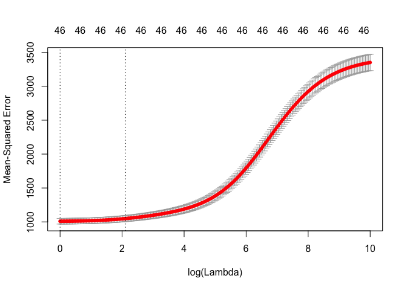

Laura\_modeling
================
Laura Cosgrove
3/28/2019

``` r
library(tidyverse)
library(caret)
library(modelr)
library(glmnet)
library(pls)
```

``` r
heart <- read_csv("./data/train_noNA.csv") %>% 
  select(-row_id)
```

    ## Parsed with column specification:
    ## cols(
    ##   .default = col_double(),
    ##   row_id = col_integer(),
    ##   heart_disease_mortality_per_100k = col_integer(),
    ##   metro_ruccs = col_character(),
    ##   population_ruccs = col_character(),
    ##   urban_influence = col_integer(),
    ##   economic_typology = col_character(),
    ##   demo__birth_rate_per_1k = col_integer(),
    ##   demo__death_rate_per_1k = col_integer(),
    ##   health__air_pollution_particulate_matter = col_integer(),
    ##   health__pop_per_dentist = col_integer(),
    ##   health__pop_per_primary_care_physician = col_integer(),
    ##   yr = col_character(),
    ##   pure_population = col_character(),
    ##   metro_adjacency = col_character()
    ## )

    ## See spec(...) for full column specifications.

``` r
x <- model.matrix(heart_disease_mortality_per_100k ~ ., data = heart)[,-1]
y <- heart$heart_disease_mortality_per_100k
```

Set up `caret` training control. We will use this for all models.

``` r
set.seed(100)
ctrl1 <- trainControl(method = "repeatedcv", number = 10, repeats = 5)
```

Ridge
-----

Cross validate to find the optimal lambda value.

``` r
set.seed(100)

ridge_fit <- train(x, y,
                     method = "glmnet",
                     tuneGrid = expand.grid(alpha = 0, 
                                            lambda = exp(seq(0, 10, length = 200))),
                    preProc = c("center", "scale"),
                    trControl = ctrl1)


plot(ridge_fit, xTrans = function(x) log(x)) #in correct range
```


``` r
best_lambda_ridge = ridge_fit$bestTune$lambda # lower lambda bc adjusted bounds

##centered, scaled coefficients from caret
predict(ridge_fit$finalModel, s = best_lambda_ridge, type="coefficients") %>% 
  broom::tidy() %>% 
  arrange(desc(abs(value)))
```

    ## Warning: 'tidy.dgCMatrix' is deprecated.
    ## See help("Deprecated")

    ## Warning: 'tidy.dgTMatrix' is deprecated.
    ## See help("Deprecated")

    ##                                                      row column
    ## 1                                            (Intercept)      1
    ## 2                                demo__death_rate_per_1k      1
    ## 3                      demo__pct_aged_65_years_and_older      1
    ## 4                        health__pct_physical_inacticity      1
    ## 5                            health__pct_low_birthweight      1
    ## 6                                        urban_influence      1
    ## 7                             econ__pct_uninsured_adults      1
    ## 8                                     demo__pct_nonwhite      1
    ## 9                              health__pct_adult_obesity      1
    ## 10                              econ__pct_civilian_labor      1
    ## 11           health__motor_vehicle_crash_deaths_per_100k      1
    ## 12                                  health__pct_diabetes      1
    ## 13                               demo__birth_rate_per_1k      1
    ## 14                          econ__pct_uninsured_children      1
    ## 15                    demo__pct_adults_with_some_college      1
    ## 16                             health__pct_adult_smoking      1
    ## 17             demo__pct_adults_with_high_school_diploma      1
    ## 18              health__air_pollution_particulate_matter      1
    ## 19                               health__pop_per_dentist      1
    ## 20                           economic_typologyRecreation      1
    ## 21                                                   yrb      1
    ## 22      demo__pct_adults_less_than_a_high_school_diploma      1
    ## 23                  demo__pct_adults_bachelors_or_higher      1
    ## 24                            metro_adjacencynonadjacent      1
    ## 25      population_ruccsUrban >20,000 metro non-adjacent      1
    ## 26                                      demo__pct_female      1
    ## 27                health__pop_per_primary_care_physician      1
    ## 28   economic_typologyFederal/State government-dependent      1
    ## 29                     economic_typologyMining-dependent      1
    ## 30                              pure_population< 250,000      1
    ## 31 population_ruccsUrban 2,500-19,999 metro non-adjacent      1
    ## 32                    pure_population250,000 - 1,000,000      1
    ## 33                       economic_typologyNonspecialized      1
    ## 34                                  metro_adjacencymetro      1
    ## 35                population_ruccsMetro 250k - 1 million      1
    ## 36                                   metro_ruccsNonmetro      1
    ## 37                       demo__pct_below_18_years_of_age      1
    ## 38                        pure_population2,500 - <20,000      1
    ## 39          population_ruccsUrban >20,000 metro-adjacent      1
    ## 40                                econ__pct_unemployment      1
    ## 41                     population_ruccsMetro > 1 million      1
    ## 42              economic_typologyManufacturing-dependent      1
    ## 43                            pure_population> 1,000,000      1
    ## 44                  population_ruccsRural metro-adjacent      1
    ## 45                                pure_population>20,000      1
    ## 46              population_ruccsRural metro non-adjacent      1
    ## 47     population_ruccsUrban 2,500-19,999 metro-adjacent      1
    ##          value
    ## 1  284.8156912
    ## 2   17.6191548
    ## 3  -14.4816132
    ## 4   11.3024641
    ## 5    7.7664818
    ## 6   -5.6218197
    ## 7    5.6160837
    ## 8   -5.0429138
    ## 9    4.8525105
    ## 10  -4.1556751
    ## 11   4.1121522
    ## 12   3.8213857
    ## 13   3.2749053
    ## 14  -3.0863461
    ## 15  -3.0368947
    ## 16   2.9630423
    ## 17   2.7926516
    ## 18  -2.4826986
    ## 19   2.2680131
    ## 20  -2.2515637
    ## 21  -2.2343407
    ## 22   2.2253144
    ## 23  -2.1873465
    ## 24   1.9482796
    ## 25   1.9282775
    ## 26   1.6956558
    ## 27  -1.5172899
    ## 28   1.3517954
    ## 29   1.3476765
    ## 30  -1.1187929
    ## 31   1.0585563
    ## 32  -1.0061447
    ## 33   0.9979767
    ## 34  -0.9463034
    ## 35  -0.9046439
    ## 36   0.8332186
    ## 37  -0.8143020
    ## 38   0.7306424
    ## 39  -0.7270674
    ## 40   0.7247763
    ## 41   0.6836860
    ## 42   0.5669630
    ## 43   0.5465185
    ## 44  -0.4522508
    ## 45   0.4058863
    ## 46   0.2361675
    ## 47  -0.1571535

``` r
#saving caret object to rdata
saveRDS(ridge_fit, "ridge.rds")
```

Our best lambda is 4.0838296, but it's not an entirely stable value because RMSE does not differ substantially in the range; that is, glm chooses a different value:

``` r
#Using Glmnet for visualization 
ridge_cv_glmnet <- cv.glmnet(x, y, 
                      alpha = 0, 
                      lambda = exp(seq(0, 10, length = 200)), 
                      type.measure = "mse")

plot(ridge_cv_glmnet, xvar = "lambda", label = TRUE)
```

    ## Warning in plot.window(...): "xvar" is not a graphical parameter

    ## Warning in plot.window(...): "label" is not a graphical parameter

    ## Warning in plot.xy(xy, type, ...): "xvar" is not a graphical parameter

    ## Warning in plot.xy(xy, type, ...): "label" is not a graphical parameter

    ## Warning in axis(side = side, at = at, labels = labels, ...): "xvar" is not
    ## a graphical parameter

    ## Warning in axis(side = side, at = at, labels = labels, ...): "label" is not
    ## a graphical parameter

    ## Warning in axis(side = side, at = at, labels = labels, ...): "xvar" is not
    ## a graphical parameter

    ## Warning in axis(side = side, at = at, labels = labels, ...): "label" is not
    ## a graphical parameter

    ## Warning in box(...): "xvar" is not a graphical parameter

    ## Warning in box(...): "label" is not a graphical parameter

    ## Warning in title(...): "xvar" is not a graphical parameter

    ## Warning in title(...): "label" is not a graphical parameter



``` r
plotmo::plot_glmnet(ridge_cv_glmnet$glmnet.fit, xvar = "lambda")
```


``` r
ridge_cv_table <- tibble(lambda_values = ridge_cv_glmnet$lambda, mse = ridge_cv_glmnet$cvm, mse_upper = ridge_cv_glmnet$cvup, mse_lower = ridge_cv_glmnet$cvlo)

##MSE
ridge_cv_table_best <- ridge_cv_table %>% 
  arrange(mse) %>% 
  filter(lambda_values == best_lambda_ridge)

ridge_mse_plot <- ridge_cv_table %>% 
  filter(lambda_values %in% exp(seq(0, 4, length = 200))) %>% 
  ggplot(aes(x = log(lambda_values), y = mse)) +
  geom_point() +
  geom_point(aes(x = log(best_lambda_ridge), y = ridge_cv_table_best$mse), color = "red") +
  geom_ribbon(aes(ymin = mse_lower, ymax = mse_upper), alpha = 0.1)
  
ridge_mse_plot + annotate("text", x = 0.5 + log(best_lambda_ridge), y = 985, label = "Lambda chosen by caret", color = "red")
```


``` r
#for fun
```

I think we should proceed with the lambda chosen by caret for better comparison.

MARS
----

We next create a piecewise linear model using multivariate adaptive regression splines (MARS).

``` r
library(pdp)
library(earth)
library(vip)
library(patchwork)
```

Since there are two tuning parameters associated with the MARS model: the degree of interactions and the number of retained terms, we need to perform a grid search to identify the optimal combination of these hyperparameters that minimize prediction error.

``` r
set.seed(100)

mars_grid <- expand.grid(degree = 1:3, 
                         nprune = 14:30) #degree: 1 vs 2 vs 3, no interaction vs. interaction;
#nprune is number of coef

set.seed(2)
mars_fit <- train(x, y,
                 method = "earth",
                 tuneGrid = mars_grid,
                 trControl = ctrl1)

ggplot(mars_fit)
```


``` r
mars_fit$bestTune
```

    ##    nprune degree
    ## 47     26      3

``` r
mars_fit$finalModel$gcv #metric earth uses to choose
```

    ## [1] 844.88

``` r
#saving caret object to rdata
saveRDS(mars_fit, "mars.rds")
```

To better understand the relationship between these features and `heart_disease_mortality_per_100k`, we can create partial dependence plots (PDPs) for each feature individually and also an interaction PDP. This is used to examine the marginal effects of predictors.

A nice way to visualize especially these black box models. We see that the model fitted by MARS gives a smaller cross validation error, because we're carefully tuning those nonlinear terms.

``` r
#Variable importance
vip::vip(mars_fit, num_features = 40, bar = FALSE, value = "gcv") + ggtitle("GCV")
```


``` r
vip::vip(mars_fit, num_features = 40, bar = FALSE, value = "rss") + ggtitle("RSS")
```


``` r
#Final coefficients: no interactions
coef(mars_fit$finalModel) %>%
  broom::tidy() %>% 
  knitr::kable()
```

    ## Warning: 'tidy.numeric' is deprecated.
    ## See help("Deprecated")

| names                                                                                                                                                       |              x|
|:------------------------------------------------------------------------------------------------------------------------------------------------------------|--------------:|
| (Intercept)                                                                                                                                                 |    287.6861382|
| h(health\_\_pct\_physical\_inacticity-0.239)                                                                                                                |    615.9297339|
| h(15-demo\_\_birth\_rate\_per\_1k) \* h(health\_\_pct\_physical\_inacticity-0.239)                                                                          |   -112.1512358|
| h(health\_\_pct\_low\_birthweight-0.092)                                                                                                                    |   -699.7448358|
| h(demo\_\_death\_rate\_per\_1k-10)                                                                                                                          |      9.3662574|
| h(10-demo\_\_death\_rate\_per\_1k)                                                                                                                          |    -13.0753471|
| h(demo\_\_pct\_aged\_65\_years\_and\_older-0.217)                                                                                                           |   -464.5557590|
| h(0.217-demo\_\_pct\_aged\_65\_years\_and\_older)                                                                                                           |    659.7649211|
| h(econ\_\_pct\_civilian\_labor-0.31)                                                                                                                        |   -115.3920352|
| h(health\_\_pct\_physical\_inacticity-0.239) \* h(0.229-demo\_\_pct\_nonwhite)                                                                              |  -1591.1120515|
| h(demo\_\_pct\_adults\_with\_high\_school\_diploma-0.269574) \* h(15-demo\_\_birth\_rate\_per\_1k) \* h(health\_\_pct\_physical\_inacticity-0.239)          |    646.6551004|
| h(demo\_\_death\_rate\_per\_1k-12) \* h(health\_\_pct\_physical\_inacticity-0.239) \* h(demo\_\_pct\_nonwhite-0.229)                                        |   -513.4975418|
| h(12-demo\_\_death\_rate\_per\_1k) \* h(health\_\_pct\_physical\_inacticity-0.239) \* h(demo\_\_pct\_nonwhite-0.229)                                        |   -259.7879177|
| h(demo\_\_death\_rate\_per\_1k-10) \* h(health\_\_pct\_physical\_inacticity-0.315)                                                                          |   -114.6747527|
| h(0.092-health\_\_pct\_low\_birthweight) \* h(2159-health\_\_pop\_per\_primary\_care\_physician)                                                            |     -0.5443680|
| h(health\_\_pct\_physical\_inacticity-0.239) \* h(13-health\_\_air\_pollution\_particulate\_matter)                                                         |     38.6098477|
| h(health\_\_pct\_low\_birthweight-0.092) \* h(2190-health\_\_pop\_per\_primary\_care\_physician)                                                            |      0.8401046|
| h(0.132-health\_\_pct\_diabetes)                                                                                                                            |   -425.3095114|
| h(demo\_\_pct\_below\_18\_years\_of\_age-0.227) \* h(health\_\_motor\_vehicle\_crash\_deaths\_per\_100k-16.36) \* h(demo\_\_pct\_nonwhite-0.024)            |    -57.4707369|
| h(demo\_\_pct\_adults\_with\_some\_college-0.294715) \* h(health\_\_pct\_diabetes-0.132)                                                                    |  36745.8413421|
| h(49.02-health\_\_motor\_vehicle\_crash\_deaths\_per\_100k)                                                                                                 |     -0.9154052|
| h(demo\_\_pct\_below\_18\_years\_of\_age-0.204) \* h(health\_\_pct\_low\_birthweight-0.092)                                                                 |  14976.2741125|
| h(demo\_\_pct\_adults\_less\_than\_a\_high\_school\_diploma-0.168831) \* h(demo\_\_death\_rate\_per\_1k-10)                                                 |    143.9552435|
| h(0.109019-demo\_\_pct\_adults\_bachelors\_or\_higher) \* h(demo\_\_death\_rate\_per\_1k-10) \* h(health\_\_motor\_vehicle\_crash\_deaths\_per\_100k-13.29) |    -15.2249872|
| h(10-urban\_influence) \* h(0.234531-demo\_\_pct\_adults\_with\_some\_college) \* h(health\_\_pct\_adult\_obesity-0.318)                                    |  -2782.1790894|
| h(0.084-econ\_\_pct\_uninsured\_children) \* h(49.02-health\_\_motor\_vehicle\_crash\_deaths\_per\_100k)                                                    |      5.5312215|

``` r
#Partial feature plots
p1 <- pdp::partial(mars_fit, pred.var = c("health__pct_physical_inacticity"), grid.resolution = 10) %>% autoplot()
p2 <- pdp::partial(mars_fit, pred.var = c("demo__birth_rate_per_1k"), grid.resolution = 10) %>% autoplot()
p3 <- pdp::partial(mars_fit, pred.var = c("health__pct_physical_inacticity", "demo__birth_rate_per_1k"), grid.resolution = 10) %>%  plotPartial(levelplot = FALSE, zlab = "yhat", drape = TRUE, colorkey = TRUE, screen = list(z = -20, x = -60))


gridExtra::grid.arrange(p1, p2, p3, ncol = 3)
```


Ridge and MARS comparison
-------------------------

``` r
set.seed(100)
summary(resamples(list(
  ridge = ridge_fit,
  MARS = mars_fit)))$statistics$RMSE
```

    ##           Min.  1st Qu.   Median     Mean  3rd Qu.     Max. NA's
    ## ridge 26.29574 30.85310 31.95307 31.88402 33.40691 36.74570    0
    ## MARS  27.07862 29.49042 31.66372 31.54741 33.29575 37.73065    0

On average, the MARS fit is slightly better.
