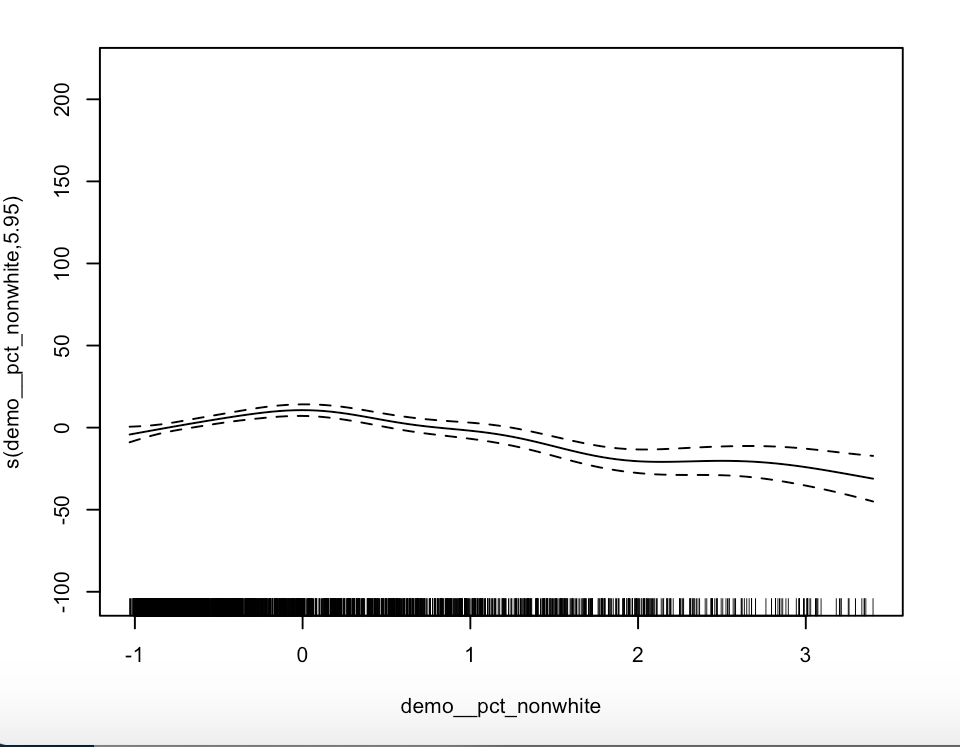

```{r setup, include=FALSE}
knitr::opts_chunk$set(echo = TRUE, warning = FALSE, message = FALSE)
library(tidyverse)
library(caret)
library(earth)
library(patchwork)
library(DALEX)
```

```{r, echo = FALSE}
heart <- read_rds("./data/full_processed_data.Rdata")

train <- read_rds("./data/train_imputed.Rdata") 
x <- model.matrix(heart_disease_mortality_per_100k ~ ., data = train)[,-1]
y <- train$heart_disease_mortality_per_100k

test = readr::read_rds("data/test_imputed.Rdata")
test_outcome = test$heart_disease_mortality_per_100k
test = model.matrix(heart_disease_mortality_per_100k ~ ., data = test)

# load the model fits from previous runs
lm_fit <- readRDS("lm_step_imputed.rds")
ridge_fit <- readRDS("ridge.rds")
mars_fit <- readRDS("mars2.rds")
gam_fit <- readRDS("gam_fit_imputed.rds")
lasso_fit <- readRDS("lasso_imputed.rds")
pcr_fit <- readRDS("pcr_imputed.rds")
```


## Introduction

Heart disease remains one of the leading causes of death in adults in the US. Understanding risk factors for diseases of this kind is an important task in working towards reducing the number of lives lost. There is obvious benefit in doing this at an individual level, examining personal lifestyle, genetic profile, and family history. But there may be important environmental components that have predictive value in assessing risk for heart disease mortality. Identifying county-level environmental and demographic predictors for heart disease mortality could aid in effective targeting of national campaigns to increase education and reduce risk. We examine economic, health, and demographic data for thousands of counties across the US. This data is synthesized from several sources, including the USDA Economic Research Service, Bureau of Labor Statistics, US Census, Behavioral Risk Factor Surveillance System, the CDC, and others. Our goal in this project is to most effectively predict the county-level heart disease mortality rate per 100,000 persons. We build 6 predictive models (stepwise linear regression, Lasso, Ridge, PCR, GAM, and MARS), and compare them on their predictive capacity quantified by the root mean squared error (RMSE).

### Exploratory Data Analysis

The average county-level heart disease mortality per 100,000 residents is `r round(mean(heart$heart_disease_mortality_per_100k), 2)`, with standard deviation `r round(sd(heart$heart_disease_mortality_per_100k), 2)`. Though approximately normally distributed, the exact density of the outcome distribution differs slightly among levels of categorical variables (Figures 1 & 2).  

In the category of health, statistics related to lifestyle characteristics (obesity, smoking, diabetes, low birthweight babies, excessive drinking, and physical inactivity) are highly intercorrelated (Figure 2a). Less so are more environmental - or "acts of God" - factors: air particulate matter, homicides, motor vehicle crashes, and rates of dentists and doctors (though the last two are highly correlated). For demography, we found categorical variables masquerading as separate predictors, leading to high intercorrelation within those categories: percentages of residents who are a given race accounts for 5 variables; age-related bins (less than 18, greater than 65) account for 2 variables; birth and death rate; and percentages of residents who complete a given level of education account for 4 variables. Given some of the subtleties in these distinctions, we condensed only race into "white" and "non-white". For economics, unsurprisingly, the percent of adults and the percent of children without health insurance  are highly correlated, as well as percent civilian labor and unemployment rate (Figure 2a).

Between categories, education-related variables are highly correlated with % civilian labor, % uninsured adults, and % physical inactivity (Table 2). Predictors strongly associated with heart disease mortality are % physical inactivity, % diabetes, % adult obesity, education-related variables, % low birthweight, and overall death rate per 1,000 (Table 3). Many of the variables most strongly-associated with the outcome are associated with one another.

## Methods

In our data pre-processing and exploratory analysis, we examined variable distributions (checking for skewness, missing data, etc). We eliminated two variables with over 90% missing data, and used K-nearest neighbors (KNN) to impute remaining missing values. The dataset was split into training and testing subsets at a parsing 2:1 ratio. There was one categorical variable for which individual factor levels had near-zero variance, but because these levels were part of a larger parameter, we did not remove them. The final dataset includes the outcome (heart disease mortality rate per 100k) and 28 predictors relating to economic, demographic, and health-related county characteristics. 

We built predictive models on the training data using 6 methods: stepwise linear regression, Lasso, Ridge, PCR, GAM, and MARS. All model builds were performed using the `caret` package, and optimal model parameters were selected based on minimizing MSE (or, in the case of MARS, and GAM, generalized cross-validation error) with 10-fold cross-validation, repeated five times. The optimal model was selected based on training RMSE, and models were again compared based on test RMSE. All R code used for model fitting is provided in the Appendix.

## Results

### Predictive Models

```{r, echo=FALSE}
train <- read_rds("./data/train_imputed.Rdata") 
x <- model.matrix(heart_disease_mortality_per_100k ~ ., data = train)[,-1]
y <- train$heart_disease_mortality_per_100k

test_df = readr::read_rds("data/test_imputed.Rdata")
test_outcome = test_df$heart_disease_mortality_per_100k
test = model.matrix(heart_disease_mortality_per_100k ~ ., data = test_df)

# load the model fits from previous runs
lm_fit <- readRDS("lm_step_imputed.rds")
ridge_fit <- readRDS("ridge.rds")
mars_fit <- readRDS("mars2.rds")
gam_fit <- readRDS("gam_fit_imputed.rds")
lasso_fit <- readRDS("lasso_imputed.rds")
pcr_fit <- readRDS("pcr_imputed.rds")
```

_Final models and RMSE_ 

All models used the majority of all 28 variables (where categorical variables were split into dummy variables).

```{r include = FALSE}

set.seed(2)
# resample each model to compare 
res <- resamples(list(
  Stepwise = lm_fit,
  Ridge = ridge_fit,
  Lasso = lasso_fit,
  PCR = pcr_fit,
  GAM = gam_fit,
  MARS = mars_fit
  ))

cv_RMSE <- summary(res)$statistics$RMSE
gam_RMSE <- summary(res)$statistics$RMSE[5,]
```

```{r, echo = FALSE}
pred_lm = predict(lm_fit, newdata = test)
pred_ridge = predict(ridge_fit, test)
pred_lasso = predict(lasso_fit, test)
pred_pcr = predict(pcr_fit, test)
pred_gam = predict(gam_fit, test)
pred_mars = predict(mars_fit, test)

data.frame(train_rmse = summary(res)$statistics$RMSE[,4],
           test_rmse = c(sqrt(mean((pred_lm - test_outcome)^2)),
                         sqrt(mean((pred_ridge - test_outcome)^2)),
                         sqrt(mean((pred_lasso - test_outcome)^2)),
                         sqrt(mean((pred_pcr - test_outcome)^2)),
                         sqrt(mean((pred_gam - test_outcome)^2)),
                         sqrt(mean((pred_mars - test_outcome)^2)))) %>%
  `colnames<-`(c("Train RMSE", "Test RMSE")) %>%
  knitr::kable(caption = "Predictive RMSE on training and test data")

```

Above, table 1 presents the RMSE of the predicted heart disease mortality rate for all models on both the training and testing datasets. Figure 3 presents the resampled training RMSE. GAM outperforms all other models in both fields, though MARS has similar performance on predicting outcomes in the test data. All linear models have similar performance.

_Coefficient Shrinkage: Lasso and Ridge_

For better visualization of coefficient shrinkage among the possible , a `glmnet` model was fit and the lambda value selected by `caret` as minimizing RMSE through cross-validated iterations was plotted (Figures 4 & 5).

_Investigation of MARS_

The minimum generalized cross-validation error was achieved for a total of 25 features, including a two-way interaction term. Variable importance (Figure 7) is assessed by tracking GCV for each predictor and accumulating the reduction in GCV when each predictor’s feature is added to the model -- the total reduction is used as the measure of variable importance. If a predictor was never used in any MARS basis function, it has an importance value of zero; 18 predictors were used in a MARS basis function.

MARS retained interactions between many sets of health-related variables, which one might expect given collinearity (and relatedness) between the within-category variable sets, as shown in Figure 8: Interaction terms were also present across categories.

_Investigation of GAM_

GAM fit 23 regression splines with a total degree of freedom of 78.05. Two splines had degrees of freedom close to 0, and therefore the predictors are effectively not included in the model: percent unemployment (econ__pct_unemployment) and percent adults with highest education of some college (demo__pct_adults_with_some_college). Additionally, four variables in total had p values > 0.05: percent unemployment, percent adults with highest education of some college, percent adults with bachelors degree or higher (demo__pct_adults_bachelors_or_higher), and total population per dentist (health__pop_per_dentist). 

Two of the regression spline fits for GAM are shown in Figures 12 & 13. For percent nonwhite residents, heart disease mortality increases from a standard deviation lower percent nonwhite residents to an average percent nonwhite residents, but from an average level of percent nonwhite residents to three standard deviations higher, heart disease mortality decreases. For percent residents below 18 years of age, change heart disease mortality varies from 4 standard deviations below average percent residents below 18 years of age to 3 standard deviations above, then sharply increases from 3 standard deviations above to 6 standard deviations above average percent residents below 18 years of age.

Compared to MARS and PCR, GAM gave more weight to the factor variable metropolitan status and metropolitan adjacency.


## Discussion

GAM was our best-performing model. With GAM, we were able to achieve a cross-validated RMSE of median `r paste(round(gam_RMSE[3], 2))` and bootstrapped interquartile range of (`r paste(round(gam_RMSE[2], 2))`, `r paste(round(gam_RMSE[5], 2))`. GAM, and MARS, also performed well on the test data. 

All models had similar distributions of residuals, shown in Figure 9.

This modeling problem was perhaps not best addressed by fitting lasso and ridge. Neither of the methods shrunk many coefficients in such a way that completely removed them from the model and improved the RMSE. The best visualization of the effect of shrinkage can be seen in the ridge coefficient plot (Figure 4), where it can be seen that the vast majority of coefficients shrunk equally. Lasso's more stringent shrinking power did not improve RMSE for this problem. Had these methods been more appropriate in this context, parameter selection might have been more obvious. As it is, as shown in Figure 6, the standard error of the mean cross-validated error is quite wide.

As described, GAM and MARS outperformed the linear models, and if the primary goal of the model is prediction, than we suggest using GAM. However, the linear models were close in performance to these more flexible models, and if simplicity and interpretability are major concerns, one of these may be preferred. For the linear model fit with stepwise selection, for every standard deviation increase of death rate per 1000 residents, heart disease mortality per 100k increases on average by 19.3 (95% CI 16.9 -- 21.6). Surprisingly, percent residents aged 65 years and older has a decreasing effect on heart disease mortality: for every standard deviation increase in percent residents aged 65 years and older, heart disease mortality per 100k decreases by 19.8 on average (95% CI -23.0 -- -16.6). Percent low birthweight increases heart disease mortality on average (1 s.d. change increases by 7.4, 95% CI 5.3 -- 9.4), and percent physical inactivity increases heart disease mortality on average (1 s.d. change increases by 9.0, 95% CI 6.5 -- 11.6).


Variable importance was relatively consistent through each model, as measured by loss-perturbed RMSE in the `caret` cross-validation and shown in Figures 10 & 11, generated by the package `DALEX`: for instance, overall death rate in a county consistently had a large, positive effect on the rate of heart disease mortality. However, compared to other models, GAM gave much more weight to the value of the geography-related factor variables metropolitan status (metro) and adjacency (metro_adjacency). Stepwise regression retained urban influence, and not other geography-related variables, and as we noted in exploratory data analysis, urban influence serves somewhat as a proxy for an interaction term between population and metropolitan status. Although the importance of particular predictors in a model with finite CV error-based parameter selection is subject to some randomness (or non-uniqueness), and therefore the meaning of importance should not be over-interpreted, it is possible that including several proxies for the same predictor type over-complicated predictor selection, particularly in the lasso, ridge, and PCR cases. A different approach to try would be to begin with fewer factor predictors and note whether lasso, ridge, and PCR would have more effective shrinkage.

\pagebreak 

## Tables and Figures

```{r, echo = FALSE, fig.cap= "Heart disease mortality differs between metropolitan status"}
heart %>% 
  ggplot(aes(x = heart_disease_mortality_per_100k, y = metro)) +
  geom_boxplot(varwidth = TRUE, notch = TRUE) +
  theme_minimal()
```

```{r, echo = FALSE, fig.width = 10, fig.cap= "Heart disease mortality is approximately normally distributed among levels of urban influence"}
#Factor Variables
heart %>% 
  ggplot(aes(x = heart_disease_mortality_per_100k, y = urban_influence, fill = urban_influence, height = ..density..)) +
  theme_minimal() +
  ggjoy::geom_joy(scale = 0.85, alpha = 0.3) +
    theme(axis.title.y=element_blank(),
        axis.text.y=element_blank(),
        axis.ticks.y=element_blank())

```

```{r, echo = FALSE, message = FALSE, warning = FALSE, fig.cap =  "Correlation within predictor categories", fig.width = 12}

##Functions
substring = function(x) {str_sub(x, start = -25)}

str_remove_hlth <- function(x) {
  str_remove(x, pattern = "health__")
}

str_remove_econ <- function(x) {
  str_remove(x, pattern = "econ__")
}

str_remove_demo <- function(x) {
  str_remove(x, pattern = "demo__")
}

str_remove_pct <- function(x) {
  str_remove(x, pattern = "pct_")
}

#Within category correlation
par(mfrow = c(1,3))

heart %>% 
  select_if(is.numeric) %>% 
  select(starts_with("econ")) %>% 
  rename_all(str_remove_econ) %>% 
  rename_all(str_remove_pct) %>% 
  rename_all(substring) %>% 
  drop_na() %>% 
  cor() %>% 
  corrplot::corrplot(method = "ellipse", title = "Figure 2a: Correlation within predictor categories")

heart %>% 
  select_if(is.numeric) %>% 
  select(starts_with("demo")) %>% 
  rename_all(str_remove_demo) %>% 
  rename_all(str_remove_pct) %>% 
  rename_all(substring) %>% 
  drop_na() %>% 
  cor() %>% 
  corrplot::corrplot(method = "ellipse") 

heart %>% 
  select_if(is.numeric) %>% 
  select(starts_with("health")) %>% 
  rename_all(str_remove_hlth) %>% 
  rename_all(str_remove_pct) %>% 
  rename_all(substring) %>% 
  drop_na() %>% 
  cor() %>% 
  corrplot::corrplot(method = "ellipse")

cor_matrix <- heart %>% 
  select_if(is.numeric) %>% 
  drop_na() %>% 
  cor()

cor_tibble = as_tibble(cor_matrix)

## Between category correlation
econ <- tibble(variable = names(cor_tibble),
                  econ__pct_civilian_labor = cor_tibble$econ__pct_civilian_labor,
       econ__pct_unemployment = cor_tibble$econ__pct_unemployment,
       econ__pct_uninsured_adults = cor_tibble$econ__pct_uninsured_adults,
       econ__pct_uninsured_children = cor_tibble$econ__pct_uninsured_children) %>% 
  filter(variable != "heart_disease_mortality_per_100k",
         !str_detect(variable, "econ")) %>% 
  arrange(variable) %>% 
  mutate(flag = case_when(abs(econ__pct_civilian_labor) > 0.6 ~ "flag",
                        abs(econ__pct_unemployment) > 0.6 ~ "flag",
                        abs(econ__pct_uninsured_adults) > 0.6 ~ "flag",
                        abs(econ__pct_uninsured_children) > 0.6 ~ "flag")) %>% 
  filter(flag == "flag") %>% 
  select(-flag)

health <- tibble(variable = names(cor_tibble),
                  health__air_pollution_particulate_matter = cor_tibble$health__air_pollution_particulate_matter,
       health__motor_vehicle_crash_deaths_per_100k = cor_tibble$health__motor_vehicle_crash_deaths_per_100k,
       health__pct_adult_obesity = cor_tibble$health__pct_adult_obesity,
       health__pct_adult_smoking = cor_tibble$health__pct_adult_smoking,
      health__pct_diabetes = cor_tibble$health__pct_diabetes,
       health__pct_low_birthweight = cor_tibble$health__pct_low_birthweight,
       health__pct_physical_inacticity = cor_tibble$health__pct_physical_inacticity,
       health__pop_per_dentist = cor_tibble$health__pop_per_dentist,
      health__pop_per_primary_care_physician = cor_tibble$health__pop_per_primary_care_physician) %>% 
  filter(variable != "heart_disease_mortality_per_100k",
         !str_detect(variable, "health")) %>% 
  arrange(variable) %>% 
  mutate(flag = case_when(abs(health__air_pollution_particulate_matter) > 0.6 ~ "flag",
                        abs(health__motor_vehicle_crash_deaths_per_100k) > 0.6 ~ "flag",
                        abs(health__pct_adult_obesity) > 0.6 ~ "flag",
                        abs(health__pct_adult_smoking) > 0.6 ~ "flag",
                      abs(health__pct_diabetes) > 0.6 ~ "flag",
                      abs(health__pct_low_birthweight) > 0.6 ~ "flag",
                      abs(health__pct_physical_inacticity) > 0.6 ~ "flag",
                      abs(health__pop_per_dentist) > 0.6 ~ "flag",
                      abs(health__pop_per_primary_care_physician) > 0.6 ~ "flag")) %>% 
  filter(flag == "flag")

econ <- econ %>% 
  gather(key = with, value = correlation, starts_with("econ")) %>% 
  filter(abs(correlation) > 0.6)

health <- health %>% 
  select(-flag) %>% 
  gather(key = with, value = correlation, starts_with("health")) %>% 
  group_by(variable) %>% 
  filter(abs(correlation) > 0.6)

multicollinearity <- full_join(econ, health)

multicollinearity %>% 
  knitr::kable(format = "latex", caption = "Highly Correlated Predictors Between Categories", digits = 2)

##Correlation with outcome
heart_attacks_cor = tibble(variable = names(cor_tibble),
                     correlation = cor_tibble$heart_disease_mortality_per_100k)

heart_attacks_cor %>% 
    arrange(desc(abs(correlation))) %>% 
    knitr::kable(format = "latex", caption = "Correlation with Outcome", digits = 2)

```

```{r, echo = FALSE, fig.cap = "GAM performance exceeded other model performance"}

# plot RMSE ad CI for each model to compare predictive ability
ggplot(res, metric = "RMSE") +
  theme_minimal() +
  labs(title = "Resampled Training RMSE")
```

```{r, echo = FALSE, warning = FALSE, fig.cap = "Shrinkage performance of lasso and ridge was poor: CV selected small shrinkage (small lambda)"}

##Coefficient Shrinkage

### Ridge 
best_lambda_ridge = ridge_fit$bestTune$lambda 

ridge_cv_glmnet <- glmnet::cv.glmnet(x, y, 
                      alpha = 0, 
                      lambda = exp(seq(-2, 10, length = 200)), 
                      type.measure = "mse")

### Lasso 
best_lambda_lasso = lasso_fit$bestTune$lambda 

lasso_cv_glmnet <- glmnet::cv.glmnet(x, y, 
                      alpha = 1, 
                      lambda = exp(seq(-2, 4, length = 200)), 
                      type.measure = "mse")

plotmo::plot_glmnet(ridge_cv_glmnet$glmnet.fit, xvar = "lambda", label = 8) +
abline(v = log(best_lambda_ridge), col = "blue") + title(sub = "CV-selected lambda in blue", xlab = "Ridge")
```

```{r, echo = FALSE, fig.cap = "Shrinkage performance of lasso and ridge was poor: CV selected small shrinkage (small lambda)"}
plotmo::plot_glmnet(lasso_cv_glmnet$glmnet.fit, xvar = "lambda", label = 8) +
abline(v = log(best_lambda_lasso), col = "blue") + title(sub = "CV-selected lambda in blue", xlab = "Lasso")
#could suggest selection of a more parsimonious model: lambda = exp(0)

#### Some of the most "important" coefficients
predict(ridge_fit$finalModel, s = best_lambda_ridge, type = "coefficients") %>% 
  broom::tidy() %>% 
  arrange(desc(abs(value))) %>% 
  top_n(10) %>% 
  knitr::kable(format = "latex", caption = "Top Absolute-Valued Coefficients, Ridge")

predict(lasso_fit$finalModel, s = best_lambda_lasso, type = "coefficients") %>% 
  broom::tidy() %>% 
  arrange(desc(abs(value))) %>% 
  top_n(10) %>% 
  knitr::kable(format = "latex", caption = "Top Absolute-Valued Coefficients, Lasso")
```

```{r, echo = FALSE, fig.cap = "Highly overlapping CIs for parameter selection of Lasso and Ridge"}
## MSE 
### Ridge
ridge_cv_table <- tibble(lambda_values = ridge_cv_glmnet$lambda, mse = ridge_cv_glmnet$cvm, mse_upper = ridge_cv_glmnet$cvup, mse_lower = ridge_cv_glmnet$cvlo)

ridge_cv_table_best <- ridge_cv_table %>% 
  arrange(mse) %>% 
  slice(which.min(abs(lambda_values - best_lambda_ridge)))

ridge_mse_plot <- ridge_cv_table %>% 
  filter(lambda_values %in% exp(seq(-2, 5, length = 200))) %>% 
  ggplot(aes(x = log(lambda_values), y = mse)) +
  geom_point() +
  geom_point(aes(x = log(best_lambda_ridge), y = ridge_cv_table_best$mse), color = "red") +
  geom_ribbon(aes(ymin = mse_lower, ymax = mse_upper), alpha = 0.3) + 
  labs(title = "Ridge Parameter Selection") +
  annotate("text", x = 0.5 + log(best_lambda_ridge), y = 1.05*ridge_cv_table_best$mse, label = "Lambda chosen by caret", color = "red") + 
  theme_minimal()

### Lasso
lasso_cv_table <- tibble(lambda_values = lasso_cv_glmnet$lambda, mse = lasso_cv_glmnet$cvm, mse_upper = lasso_cv_glmnet$cvup, mse_lower = lasso_cv_glmnet$cvlo)

lasso_cv_table_best <- lasso_cv_table %>% 
  arrange(mse) %>% 
  slice(which.min(abs(lambda_values - best_lambda_lasso)))

lasso_mse_plot <- lasso_cv_table %>% 
  filter(lambda_values %in% exp(seq(-2, 0, length = 200))) %>% 
  ggplot(aes(x = log(lambda_values), y = mse)) +
  geom_point() +
  geom_point(aes(x = log(best_lambda_lasso), y = lasso_cv_table_best$mse), color = "red") +
  geom_ribbon(aes(ymin = mse_lower, ymax = mse_upper), alpha = 0.3) +
  labs(title = "Lasso Parameter Selection") + 
  theme_minimal()
library(patchwork)

ridge_mse_plot + lasso_mse_plot
```

```{r, echo = FALSE, fig.width = 10, fig.cap = "Variable Importance of MARS fit"}
vip::vip(mars_fit, num_features = 18, bar = FALSE, value = "gcv") + ggtitle("GCV")
```

```{r, echo = FALSE, fig.width = 10, fig.cap = "Partial Dependence Plots, MARS"}
##Functions
str_remove_hlth <- function(x) {
  str_remove(x, pattern = "health__")
}

str_remove_econ <- function(x) {
  str_remove(x, pattern = "econ__")
}

str_remove_demo <- function(x) {
  str_remove(x, pattern = "demo__")
}

p1 <- pdp::partial(mars_fit, pred.var = c("health__pct_physical_inacticity"), grid.resolution = 10) %>% autoplot()
p2 <- pdp::partial(mars_fit, pred.var = c("demo__pct_aged_65_years_and_older"), grid.resolution = 10) %>% autoplot()
p3 <- pdp::partial(mars_fit, pred.var = c("health__pct_diabetes"), grid.resolution = 10) %>% autoplot()
p4 <- pdp::partial(mars_fit, pred.var = c("health__pop_per_dentist"), grid.resolution = 10) %>% autoplot()

p5 <- pdp::partial(mars_fit, pred.var = c("health__pct_physical_inacticity", "demo__pct_aged_65_years_and_older"), grid.resolution = 10) %>%  pdp::plotPartial(levelplot = FALSE, zlab = "yhat", drape = TRUE, colorkey = TRUE, screen = list(z = -20, x = -60))
p6 <- pdp::partial(mars_fit, pred.var = c("health__pct_diabetes", "demo__pct_aged_65_years_and_older"), grid.resolution = 10) %>%  pdp::plotPartial(levelplot = FALSE, zlab = "yhat", drape = TRUE, colorkey = TRUE, screen = list(z = -20, x = -60))
p7 <- pdp::partial(mars_fit, pred.var = c("health__pct_diabetes", "health__pop_per_dentist"), grid.resolution = 10) %>%  pdp::plotPartial(levelplot = FALSE, zlab = "yhat", drape = TRUE, colorkey = TRUE, screen = list(z = -20, x = -60))


gridExtra::grid.arrange(p1, p2, p3, p5, p6, p7, ncol = 3)

```

```{r residuals, echo=FALSE, fig.cap = "Similar CDF of residuals by model"}
explainer_gam <- DALEX::explain(gam_fit, label = "gam", data = test, y = test_outcome)
explainer_mars <- DALEX::explain(mars_fit, label = "mars", data = test, y = test_outcome)
explainer_pcr <- DALEX::explain(pcr_fit, label = "pcr", data = test, y = test_outcome)
explainer_lasso <- DALEX::explain(lasso_fit, label = "lasso", data = test, y = test_outcome)
explainer_ridge <- DALEX::explain(lasso_fit, label = "ridge", data = test, y = test_outcome)
explainer_step <- DALEX::explain(lasso_fit, label = "step", data = test, y = test_outcome)

mp_gam <- model_performance(explainer_gam)
mp_mars <- model_performance(explainer_mars)
mp_pcr <- model_performance(explainer_pcr)
mp_lasso <- model_performance(explainer_lasso)
mp_ridge <- model_performance(explainer_ridge)
mp_step <- model_performance(explainer_step)

plot(mp_gam, mp_mars, mp_pcr, mp_lasso)
```

```{r variable importance, echo=FALSE, fig.cap = "GAM performance relies heavily on the weight of metropolitan status"}
explainer_gam <- DALEX::explain(gam_fit, label = "gam", data = test, y = test_outcome)
explainer_mars <- DALEX::explain(mars_fit, label = "mars", data = test, y = test_outcome)
explainer_pcr <- DALEX::explain(pcr_fit, label = "pcr", data = test, y = test_outcome)
explainer_lasso <- DALEX::explain(lasso_fit, label = "lasso", data = test, y = test_outcome)
explainer_ridge <- DALEX::explain(lasso_fit, label = "ridge", data = test, y = test_outcome)
explainer_step <- DALEX::explain(lasso_fit, label = "step", data = test, y = test_outcome)

vi_gam <- variable_importance(explainer_gam, loss_function = loss_root_mean_square)
vi_mars <- variable_importance(explainer_mars, loss_function = loss_root_mean_square)
vi_pcr <- variable_importance(explainer_pcr, loss_function = loss_root_mean_square)
vi_lasso <- variable_importance(explainer_lasso, loss_function = loss_root_mean_square)
vi_ridge <- variable_importance(explainer_ridge, loss_function = loss_root_mean_square)
vi_step <- variable_importance(explainer_step, loss_function = loss_root_mean_square)

plot(vi_gam, vi_mars, vi_pcr)
```

```{r variable importance 2, echo=FALSE, fig.cap = "Linear models had similar variable importance"}
plot(vi_lasso, vi_ridge, vi_step)
```

```{r, echo = FALSE, fig.cap = "GAM smoothing splines fit", out.width = "80%"}
knitr::include_graphics("gam_s(18yrs_younger).png")

```
