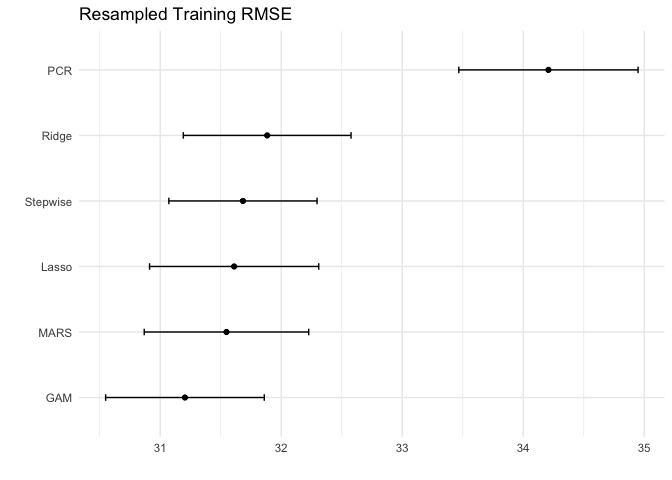

project
================
Laura Cosgrove
3/26/2019

Introduction
------------

### Background (Alyssa)

### Exploratory Data Analysis (Laura)

Linear Models
-------------

### Stepwise Selection (Alyssa)

### Lasso (Charlotte)

### Ridge (Laura)

### PCR (Charlotte)

Nonlinear Models
----------------

### GAM (Alyssa)

### MARS (Laura)

Classification Setting?
-----------------------

### KNN?

Conclusions
-----------

### Training RMSE

``` r
set.seed(100)
library(tidyverse)
```

    ## ── Attaching packages ──────────────────────────────────────────────────────────────────────────────── tidyverse 1.2.1 ──

    ## ✔ ggplot2 3.1.0     ✔ purrr   0.2.5
    ## ✔ tibble  1.4.2     ✔ dplyr   0.7.8
    ## ✔ tidyr   0.8.2     ✔ stringr 1.3.1
    ## ✔ readr   1.1.1     ✔ forcats 0.3.0

    ## ── Conflicts ─────────────────────────────────────────────────────────────────────────────────── tidyverse_conflicts() ──
    ## ✖ dplyr::filter() masks stats::filter()
    ## ✖ dplyr::lag()    masks stats::lag()

``` r
library(caret)
```

    ## Loading required package: lattice

    ## 
    ## Attaching package: 'caret'

    ## The following object is masked from 'package:purrr':
    ## 
    ##     lift

``` r
ridge_fit <- readRDS("ridge.rds")
mars_fit <- readRDS("mars.rds")
gam_fit <- readRDS("gam_fit.rds")
lasso_fit <- readRDS("lasso.rds")
pcr_fit <- readRDS("pcr.rds")

res <- resamples(list(
  ridge = ridge_fit,
  lasso = lasso_fit,
  MARS = mars_fit
  ))

res2 <- resamples(list(
  GAM = gam_fit,
  pcr = pcr_fit))


p1 <- ggplot(res, metric = "RMSE") +
  theme_minimal()

p2 <- ggplot(res2, metric = "RMSE") +
  theme_minimal()

library(patchwork)

p1 / p2
```



### Test RMSE (Alyssa)

### Interpretations (Laura)
